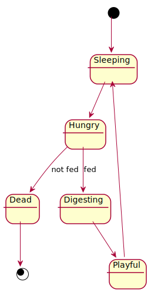
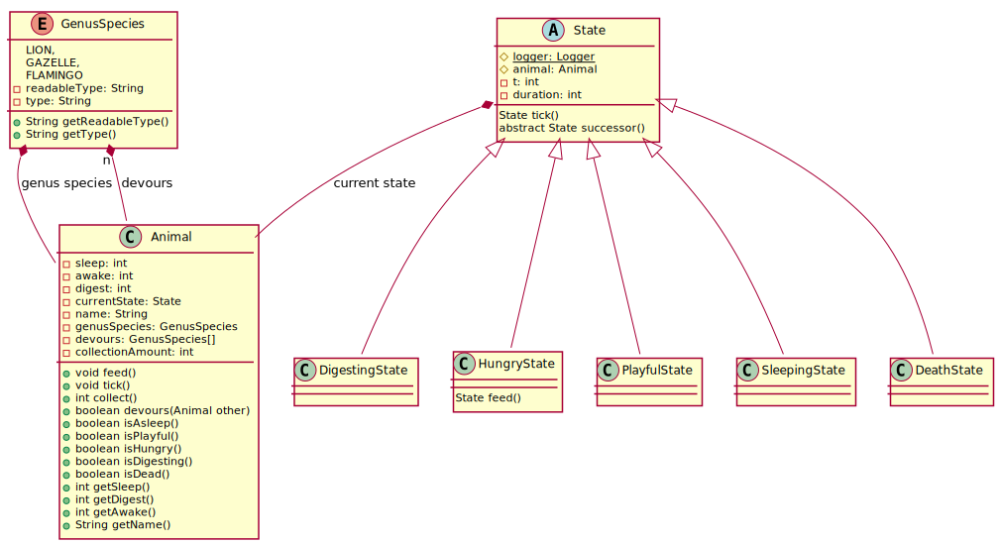

_This is an assignment to the class [Advanced Programming](https://hsro-inf-fpk.github.io) at the [University of Applied Sciences Rosenheim](http://www.th-rosenheim.de)._

# Assignment 3: Inheritance revisited

In this assignment we'll be looking at

* a classical refactoring situation: you have code that works, but with bad implementation
* `abstract` classes
* `final` classes
* when to use `abstract` base classes

Given is a class `Cat` which represents the lifecycle of a cat, as it would be modeled in a simple game.
As time progresses, the main game engine calls `.tick()` on every cat to simulate the progress of time.
In the following you can see the lifecycle of cats modeled as [state machine](https://en.wikipedia.org/wiki/Finite-state_machine).

1. it starts in a sleeping state
2. after a certain time it awakes and is hungry
3. if you feed it in time it starts to digest otherwise it's dying
4. again after a certain time it has finished digesting and is getting in a playful mood (now you could `collect()` money)
5. once again after a certain time it's getting tired and goes back to sleep

## Setup

1. Create a fork of this repository (button in the right upper corner)
2. Clone the project (you're getting the link by clicking the green _Clone or download_ button)
3. Import the project to your IDE (remember the guide of the first assignment)

## Your Assignment

First, understand the given implementation of the `Cat.tick()` method which is based on a `switch-case`; see the `CatTest` class for example state transitions.
Your job is to replace the existing `switch-case` by a clever polymorphism construct (which might be difficult to understand in contrast to the relatively simple state machine).
To get you an idea how this is possible, consider the UML diagram below.
It models an `abstract` base class `State` which implements (!) the `tick()` method and has an `abstract` method `successor()`; note that both methods use `Cat` reference as argument.
This method is needed to get the successor state if enough time passed (e.g. the cat has completed digesting and is getting in playful mood).

Note that the `State.tick()` method should be marked `final`; why is that?

_Hint: there's still one special case: when the cat was fed it's switching to the **digesting** state immediately no matter how long it was hungry before._

The test suite to ensure that the behavior is still the same is given, too.
That's a classical refactoring situation.
You want to replace an existing implementation by a _better_ one but the behavior shouldn't change.
Now you might get an idea why test cases are important beside the fact that they ensure that you're implementation is working correctly when you do it the first time.

